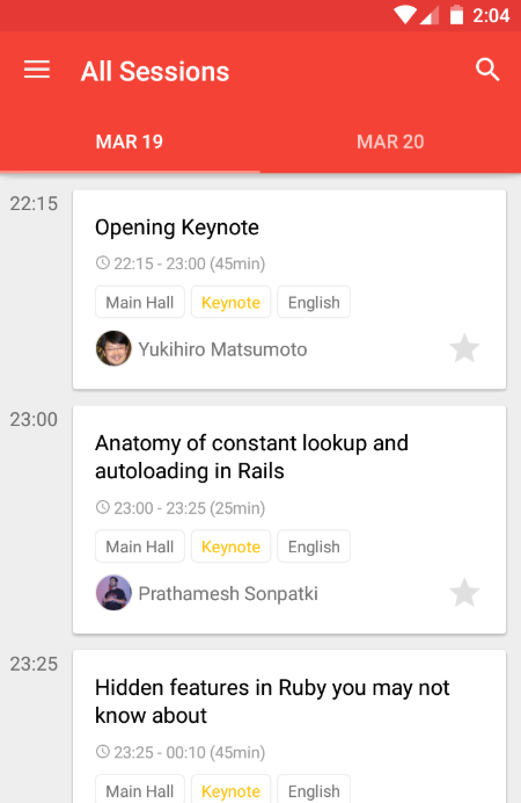

#  RubyConfIndia 2016 Unofficial Android app

[RubyConfIndia](http://rubyconfindia.org/) is a conference tailored for ruby developers on 19th and 20th March 2016.


## Features



* Show all sessions
* Manage schedule
* Show map
* Search sessions and speakers


## Libraries
This project is based on [DroidKaigi](https://droidkaigi.github.io/2016/en/) Official App.

Thanks a lot for the awesome app.

## License

```
Copyright 2016 Pritesh Jain

Licensed under the Apache License, Version 2.0 (the "License");
you may not use this file except in compliance with the License.
You may obtain a copy of the License at

   http://www.apache.org/licenses/LICENSE-2.0

Unless required by applicable law or agreed to in writing, software
distributed under the License is distributed on an "AS IS" BASIS,
WITHOUT WARRANTIES OR CONDITIONS OF ANY KIND, either express or implied.
See the License for the specific language governing permissions and
limitations under the License.
```
